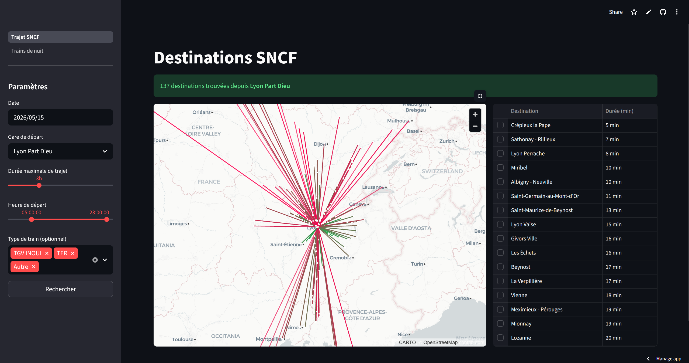
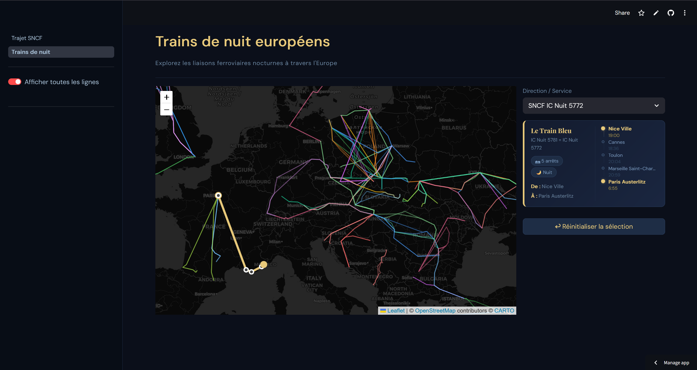

# SNCF Explorer

> Application de visualisation des données ferroviaires françaises et européennes    
> Données issues d'un pipeline Databricks (architecture Médaillon Bronze → Silver → Gold)  

 

---

## Fonctionnalités

### Destinations depuis une gare
- Sélectionne une gare de départ
- Visualise toutes les destinations atteignables sur une carte interactive
- Détail des trains disponibles

### Trains de nuit en Europe
- Carte de toutes les lignes de nuit européennes
- Informations par ligne (opérateur, trajet, fréquence)

---

## Stack technique

| Composant | Technologie |
|-----------|-------------|
| Framework | Streamlit |
| Carte interactive | Folium |
| Traitement données | Pandas |
| Source de données | Databricks (tables Delta) |
| Hébergement | Streamlit Community Cloud |

---

## Aperçu

---

## Contact

  
